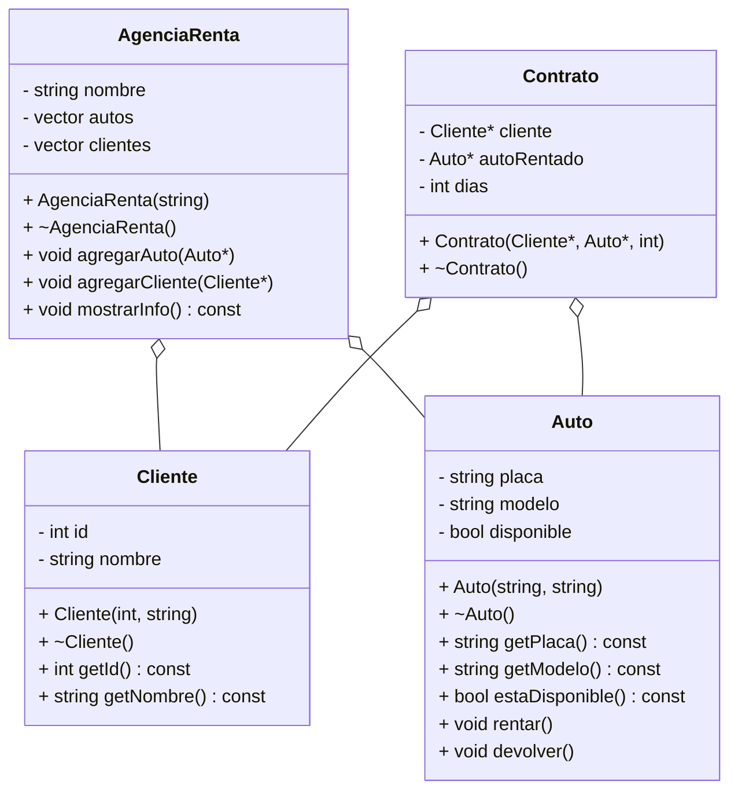

```mermaid

classDiagram
    class Auto {
        - string placa
        - string modelo
        - bool disponible
        + Auto(string, string)
        + ~Auto()
        + string getPlaca() const
        + string getModelo() const
        + bool estaDisponible() const
        + void rentar()
        + void devolver()
    }

    class Cliente {
        - int id
        - string nombre
        + Cliente(int, string)
        + ~Cliente()
        + int getId() const
        + string getNombre() const
    }

    class Contrato {
        - Cliente* cliente
        - Auto* autoRentado
        - int dias
        + Contrato(Cliente*, Auto*, int)
        + ~Contrato()
    }

    class AgenciaRenta {
        - string nombre
        - vector<Auto*> autos
        - vector<Cliente*> clientes
        + AgenciaRenta(string)
        + ~AgenciaRenta()
        + void agregarAuto(Auto*)
        + void agregarCliente(Cliente*)
        + void mostrarInfo() const
    }

    AgenciaRenta o-- Auto
    AgenciaRenta o-- Cliente
    Contrato o-- Cliente
    Contrato o-- Auto

```
